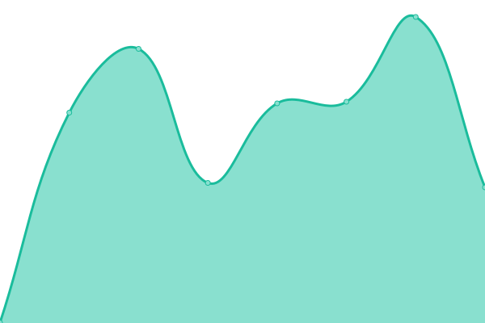
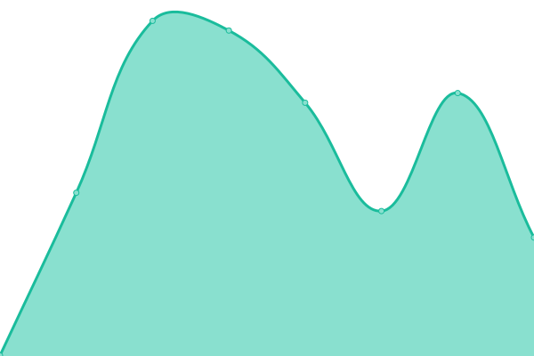
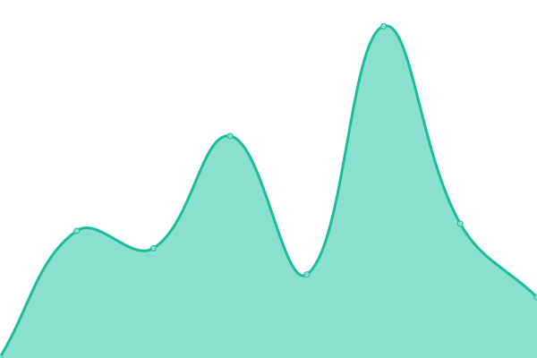
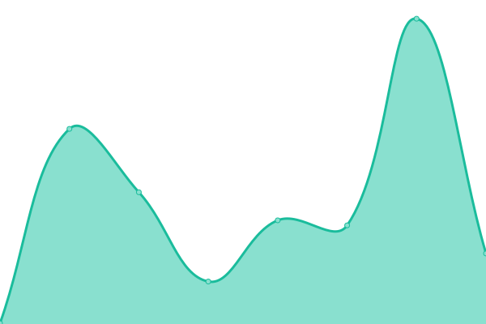
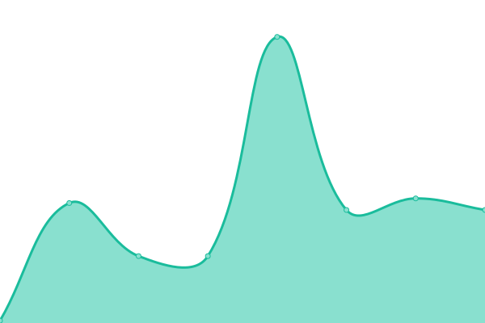
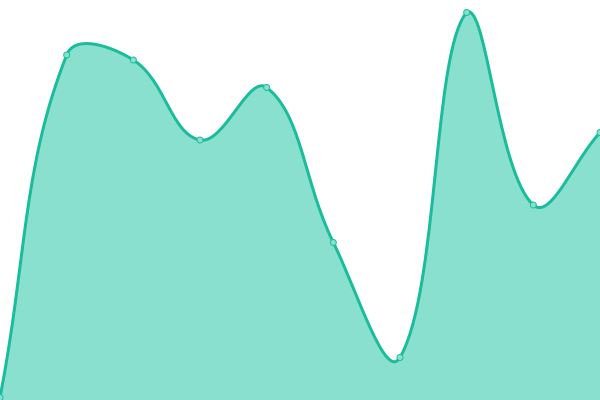

# [📈 Live Status](https://crankrune.github.io/upptime): <!--live status--> **🟧 Partial outage**

This repository contains the open-source uptime monitor and status page for [crankrune](https://crankrune.github.io/upptime), powered by [Upptime](https://github.com/upptime/upptime).

With [Upptime](https://upptime.js.org), you can get your own unlimited and free uptime monitor and status page, powered entirely by a GitHub repository. We use [Issues](https://github.com/crankrune/upptime/issues) as incident reports, [Actions](https://github.com/crankrune/upptime/actions) as uptime monitors, and [Pages](https://crankrune.github.io/upptime) for the status page.

<!--start: status pages-->
<!-- This summary is generated by Upptime (https://github.com/upptime/upptime) -->
<!-- Do not edit this manually, your changes will be overwritten -->
<!-- prettier-ignore -->
| URL | Status | History | Response Time | Uptime |
| --- | ------ | ------- | ------------- | ------ |
|  [Jellyfin](https://jellyfin.crankrune.dedyn.io/) | 🟥 Down | [jellyfin.yml](https://github.com/Crankrune/upptime/commits/HEAD/history/jellyfin.yml) | 

 1212ms
     
 | 

<a href="https://crankrune.github.io/upptime/history/jellyfin">99.47%</a>
    

|  [Navidrome](https://music.crankrune.dedyn.io/) | 🟥 Down | [navidrome.yml](https://github.com/Crankrune/upptime/commits/HEAD/history/navidrome.yml) | 

 312ms
     
 | 

<a href="https://crankrune.github.io/upptime/history/navidrome">99.48%</a>
    

|  [NGINX](http://crankrune.dedyn.io/) | 🟩 Up | [nginx.yml](https://github.com/Crankrune/upptime/commits/HEAD/history/nginx.yml) | 

 108ms
     
 | 

<a href="https://crankrune.github.io/upptime/history/nginx">100.00%</a>
    

|  [Plex](https://plex.crankrune.dedyn.io/web/index.html#!/) | 🟥 Down | [plex.yml](https://github.com/Crankrune/upptime/commits/HEAD/history/plex.yml) | 

 0ms
     
 | 

<a href="https://crankrune.github.io/upptime/history/plex">0.00%</a>
    

|  [Portainer](https://portainer.crankrune.dedyn.io/) | 🟩 Up | [portainer.yml](https://github.com/Crankrune/upptime/commits/HEAD/history/portainer.yml) | 

 249ms
     
 | 

<a href="https://crankrune.github.io/upptime/history/portainer">100.00%</a>
    

|  [Seerr](https://seerr.crankrune.dedyn.io/) | 🟩 Up | [seerr.yml](https://github.com/Crankrune/upptime/commits/HEAD/history/seerr.yml) | 

 530ms
     
 | 

<a href="https://crankrune.github.io/upptime/history/seerr">99.49%</a>
    

|  [Weather Dashboard](http://weather.crankrune.dedyn.io/) | 🟩 Up | [weather-dashboard.yml](https://github.com/Crankrune/upptime/commits/HEAD/history/weather-dashboard.yml) | 

 135ms
     
 | 

<a href="https://crankrune.github.io/upptime/history/weather-dashboard">100.00%</a>
    

|  [Uptime Kuma](http://uptime.crankrune.dedyn.io/) | 🟩 Up | [uptime-kuma.yml](https://github.com/Crankrune/upptime/commits/HEAD/history/uptime-kuma.yml) | 

 386ms
     
 | 

<a href="https://crankrune.github.io/upptime/history/uptime-kuma">100.00%</a>
    

|  [Google DNS](https://8.8.8.8) | 🟩 Up | [google-dns.yml](https://github.com/Crankrune/upptime/commits/HEAD/history/google-dns.yml) | 

 120ms
     
 | 

<a href="https://crankrune.github.io/upptime/history/google-dns">100.00%</a>
    

|  [Cloudflare DNS](https://1.1.1.1) | 🟩 Up | [cloudflare-dns.yml](https://github.com/Crankrune/upptime/commits/HEAD/history/cloudflare-dns.yml) | 

 140ms
     
 | 

<a href="https://crankrune.github.io/upptime/history/cloudflare-dns">100.00%</a>
    

<!--end: status pages-->

[**Visit our status website →**](https://crankrune.github.io/upptime)

## 📄 License

- Powered by: [Upptime](https://github.com/upptime/upptime)
- Code: [MIT](./LICENSE) © [Anand Chowdhary](https://anandchowdhary.com), supported by [Pabio](https://pabio.com)
- Data in the `./history` directory: [Open Database License](https://opendatacommons.org/licenses/odbl/1-0/)
